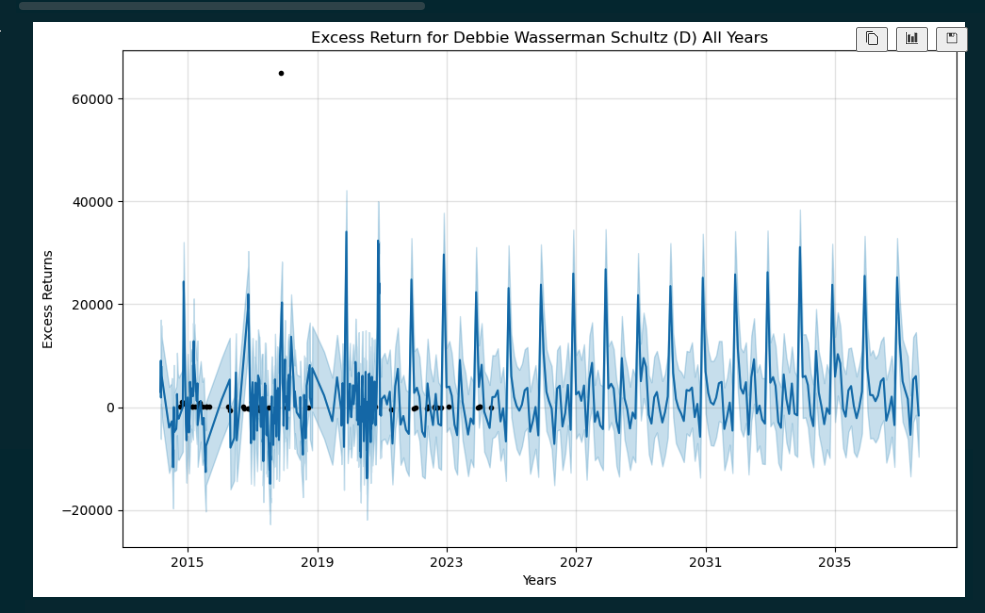

# Congress Stock Trades Analysis

## Overview

Pull CSV data from quiverquant for trades of congress members to analyze and predict future trends.

The goal the analysis was to identify patterns in excess returns within the years of 2019-2021. The trades are analyzed from multiple perspectives.
* Analyze the overall volume of trades for the top 3 most traded representatives from each party.
* Identify the most commonly traded companies from 2019-2021 for the top trading representatives.
* Identify the average excess return from 2019-2021 for each top trading representative.
* Identify the party with the highest excess return from 2019-2021 based on the top performing representatives.
* Find the top 3 performing representatives with the highest excess return from each party for all years, and predict future returns.
* Find the top performing politician overall for all years and predict future returns.
* Figure out if it is worth making investments based on the performance of a given politician, or a given party.
* Identify the top traded healthcare stock from 2019-2021.
* Identify if it is worth making investments into healthcare stock based on political party.

## Getting Started

Open the project and run the command below

```bash
jupyter notebook
```

Then, open the `main.ipynb` file and run the cells to install the dependencies and see the output for the work.

## Analysis


## Top Traders *Shayne*


### Who are the Top 6 Political Traders?
Filtering the data to fit specific needs, this  portion of the data focuses mainly on the top 6 politicians
that made the most trades overall. These traders happened to be:
* Josh Gottheimer (D)
* Lois Frankel (D)
* Susie Lee (D)
* Thomas Macarthur (R)
* David Perdue (R)
* Greg Gianforte (R)

### What Were the Top Traded Companies? What were their average Excess Returns?
With the knowledge of who the top 6 politician traders were, I filtered the data to only depict the
trade information within the time-span of 2019-2021. Once this content was filtered I 
identified which Company was traded with the most for each of the politicians. I took this
a step further by calculating the average excess return for each of these companies.
* JG-- Microsoft Corporation-- 156 total trades
* LF-- Dupont De Nemoours, Inc.-- 10 total trades
* SL-- Ball Corporation-- 21 total trades


* TM-- Interactive Brokers Group Inc.-- 1 total trade
* DP-- Caesars Entertainment Corporation-- 33 total trades
* GG-- AMN Healthcare Services Inc.-- 15 total trades


When first determining the top companies traded within the filtered time span, I was surprised
that only one of the politicians really invested in a Healthcare service the most. Though the 
average excess returns for said healthcare incorporation explains why. Greg's trades with
AMN Healthcare Services Inc. accrued him an excess return average of -48.22 when I expected
the excess return in this timeframe to be positive.

Furthering this information, I had expected at least 2/3rds of the politicians for each party
to have a positive average excess rate for their top traded company, however, that was only true 
for the top 3 republicans.


COMPARED TO


### What was the excess return average overall?
These results may appear shocking... though what shocked me the most was when I found the
average excess returns overall for the top 6 traders. It was a lot more negative than 
one would expect.


Only Thomas Macarthur from the Republican party and Josh Gottheimer of the Democratic party
resulted with positive excess return averages, though, due to an oversight made when originally gathering the
data, Thomas Macarthur only had a positive excess return average out of circumstance as he was only in office
for one trade during 2019.


When push comes to shove, during the years of 2019-2021, excess return averages were 3/5ths negative. So it is
safe for one to assume that investing in certain companies or trades in general during the prior mentioned years
was clearly not the best idea, and the Democratic Party's results provide proof for that assumption in my collection
of top traders.


## Is there a difference in excess return based on the political party?

This section aims to identify the excess return of each party, the highest performing politician,
the excess return from 2019-2021, and the highest performing politician from 2019-2021, as well as provide future analysis of the excess returns for each party, and for the top performing politician.

The goal is to identify if there is in party performance, or a trend in the performance of an individual
that is worth making similar investments for someone outside of politics. It is expected that there is a difference in stock performance based on party, but not expected that the party as a whole is not going to be profitible. It is also expected that making investments based on the top performing politician will be valuable.

### Which party had the highest excess return for all trades?

Overall for all trades, both parties were extremely negative in their losses for the sum of their excess returns. The excess return for Republicans for all years was -548,337.29, and the excess return for Democrat for all years was -123,073.97. Based on the analysis of the excess return based on party, it is not worth making financial investments based on a specific political party.

### Which party had the highest excess return for all years for the top performing politicians?

When it comes to excess return based on the best performing politicians there was a clear answer as to which party was more profitable. When only considering the top 3 performers for each party the Democrats had a higher excess return than the Republicans. The Democrats came out to 151,888.77, and the excess return for the Republicans was 77,908. This came out to a 48.71% higher excess return based on the performance of the Democrats over the Republicans.

### Which party had the highest excess return from 2019-2021?

When comparing the excess return by party from 2019-2021 the excess return was a lot closer. Both parties were positive. The excess return for the Republicans was 35,392.47 while the Democrats excess return was 30,051.73. The Republicans had an excess return that was 17.80% higher than that of the Democrats.

### Which politician performed the best across all years?

Debbie Wasserman Schultz (D) had the highest excess return of 64,404.63 for all years. The top 6 politicians are ranked in order below. The highest performing Democrat out-earned the highest earning Republican by 39.16%.
	1. Debbie Wasserman Schultz (D)    64404.63
	2. Whitehouse, Sheldon (D)         63956.88
	3. Roberts, Pat (R)                46277.25
	4. Thomas Suozzi (D)               23527.26
	5. Mark Green (R)                  18811.46
	6. Roger W. Marshall (R)           12819.79

### Which politician performed the best from 2019-2021?

Thomas Suozzi (D) had the highest excess return of 27,117.85 from 2019 - 2021. The next highest performer was Mark Green (R) with an excess return of 18,811.46. Thomas Suozzi (D) outperformed Mark Green (R) by 44.16% from 2019-2021.
	1. Thomas Suozzi (D)               27117.85
	2. Mark Green (R)                  18811.46
	3. Roberts, Pat (R)                13924.25
	4. Whitehouse, Sheldon (D)          3561.18
	5. Roger W. Marshall (R)            2656.76
	6. Debbie Wasserman Schultz (D)     -627.30

### Is it worth making investments based on the performance of a political party?

No, it is not worth making investments based on the performance of a party. Both parties as a whole had a very high negative return.

### Is it worth making investments based on the performance of a a single politician?

Yes, it is worth making investments based on the performance of a single politician based on how well they are currently performing. It is not worth making investments based on a politician based on overall volume of trades. The investment is worth it based on their overall excess returns. The top performing Republicans did not have data past the year 2021, so the future predictions begin then as opposed to 2024 which is where the Democrat future predictions begin.

### What do the future predictions indicate about the excess returns of the Republicans?

The future predictions indicate that there will be a gradual rise over the years of the excess return for the top performing Republicans, with highs and lows over the years as it increases. The highs and lows appear to be regular each year, so an investor may be able to make an informed decision based on current market trends and their knowledge of the future analysis to increase their return.


### What do the future predictions indicate about the excess returns of the Democrats?

The future predictions indicate that there will be a gradual decline over the years of the excess return for the top performing Democrats, with highs and lows over the years as it decreases. Based on the future predictions it will not be worth it to make a long term investment based on the top performing Democrats. This could be because there is an outlier with Debbie Wasserman Schultz (D) of over 60,000 on a single investment which could have skewed the initial data presented to appear like the Democrats as a whole are more profitable in the long run, when in reality the future predictions indicate that the republicans will be more profitable.


### What do the future predictions indicate about the excess returns of Debbie Wasserman Schultz (D)?

The future predictions indicate that there will be a gradual rise over the years of the excess return for Debbie Wasserman Schultz (D), with highs and lows over the years as it increases.



### Can someone accurately predict when to buy and sell stocks based on the forecasts?

Based on the forecasts it looks like there are consistent highs and lows each year. A buyer might not be able to anticipate exactly when to buy and sell, but they can anticipate market fluctions and invest accordingly based on their own experience and levels of risk they are willing to take.

## Healthcare sector during 2019-2021

### Identify the top traded healthcare stock from 2019-2021.

top traded healthcare stock(sale) from 2019-2021 by party, 


AMN Healthcare Services was the top traded amongst both parties. 

There didn't seem to be a ton of movement during this time with these sector of stocks, 

Of the few investment sell offs during this time period it did seem to lean heavily favorable for the democrats,
however it really one individual with the bulk of trades. (Susie) 

As for the republicans it does show only one sale for a pretty massive loss (will look at other data sources)


### Identify if it is worth making investments into healthcare stock based on political party.
For investment purposes in healthcare during 2019-2021, it would be wise to follow a single individual based on these results (Susie)

Hindsight is always 20-20. 